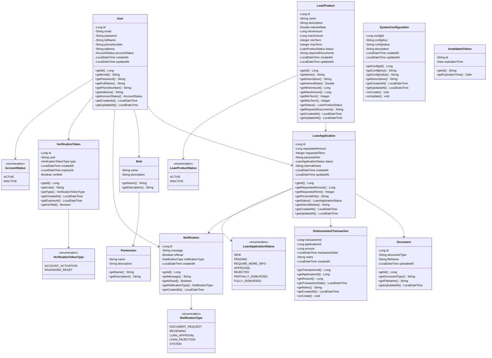

# Biểu đồ lớp - Hệ thống quản lý cho vay (Loan Management System)

## Tổng quan
Hệ thống quản lý cho vay bao gồm các thực thể chính quản lý người dùng, sản phẩm cho vay, đơn xin vay, tài liệu và các giao dịch giải ngân.

## Biểu đồ lớp UML

## Mô tả chi tiết các lớp và mối quan hệ

### Các mối quan hệ trong hệ thống:

#### 1. **User (Người dùng)**
- **Mục đích**: Quản lý thông tin người dùng trong hệ thống
- **Thuộc tính chính**: email, password, fullName, phoneNumber, address
- **Mối quan hệ**: 
  - `User --> Role` : **Many-to-One** (Nhiều User có thể có cùng một Role)
  - `User --> LoanApplication` : **One-to-Many** (Một User có thể tạo nhiều LoanApplication)
  - `User --> Notification` : **One-to-Many** (Một User có thể nhận nhiều Notification)
  - `User --> VerificationToken` : **One-to-Many** (Một User có thể có nhiều VerificationToken)
  - `User --> AccountStatus` : **Many-to-One** (Nhiều User có thể có cùng AccountStatus)

#### 2. **Role (Vai trò)**
- **Mục đích**: Quản lý vai trò của người dùng trong hệ thống
- **Thuộc tính chính**: name, description
- **Mối quan hệ**:
  - `Role --> Permission` : **Many-to-Many** (Một Role có thể có nhiều Permission, một Permission có thể thuộc nhiều Role)

#### 3. **Permission (Quyền hạn)**
- **Mục đích**: Quản lý các quyền hạn cụ thể trong hệ thống
- **Thuộc tính chính**: name, description

#### 4. **LoanProduct (Sản phẩm cho vay)**
- **Mục đích**: Quản lý các sản phẩm cho vay
- **Thuộc tính chính**: name, interestRate, minAmount, maxAmount, minTerm, maxTerm
- **Mối quan hệ**: 
  - `LoanProduct --> LoanApplication` : **One-to-Many** (Một LoanProduct có thể được sử dụng trong nhiều LoanApplication)
  - `LoanProduct --> LoanProductStatus` : **Many-to-One** (Nhiều LoanProduct có thể có cùng trạng thái)

#### 5. **LoanApplication (Đơn xin vay)**
- **Mục đích**: Quản lý đơn xin vay của khách hàng
- **Thuộc tính chính**: requestedAmount, requestedTerm, personalInfo, status
- **Mối quan hệ**:
  - `LoanApplication --> Document` : **One-to-Many** (Một LoanApplication có thể có nhiều Document)
  - `LoanApplication --> DisbursementTransaction` : **One-to-Many** (Một LoanApplication có thể có nhiều DisbursementTransaction)
  - `LoanApplication --> Notification` : **One-to-Many** (Một LoanApplication có thể tạo ra nhiều Notification)
  - `LoanApplication --> LoanApplicationStatus` : **Many-to-One** (Nhiều LoanApplication có thể có cùng trạng thái)

#### 6. **Document (Tài liệu)**
- **Mục đích**: Quản lý tài liệu đính kèm cho đơn xin vay
- **Thuộc tính chính**: documentType, fileName, uploadedAt
- **Mối quan hệ**: Thuộc về một LoanApplication duy nhất (**Many-to-One**)

#### 7. **DisbursementTransaction (Giao dịch giải ngân)**
- **Mục đích**: Quản lý các giao dịch giải ngân cho các đơn vay được duyệt
- **Thuộc tính chính**: amount, transactionDate, notes
- **Mối quan hệ**: Liên kết với một LoanApplication duy nhất (**Many-to-One**)

#### 8. **Notification (Thông báo)**
- **Mục đích**: Quản lý thông báo gửi đến người dùng
- **Thuộc tính chính**: message, isRead, notificationType
- **Mối quan hệ**:
  - Thuộc về một User duy nhất (**Many-to-One**)
  - Có thể liên kết với một LoanApplication (**Many-to-One**, optional)
  - `Notification --> NotificationType` : **Many-to-One** (Nhiều Notification có thể có cùng loại)

#### 9. **VerificationToken (Token xác thực)**
- **Mục đích**: Quản lý token cho việc xác thực tài khoản và reset mật khẩu
- **Thuộc tính chính**: uuid, type, createdAt, expiresAt, verified
- **Mối quan hệ**: 
  - Thuộc về một User duy nhất (**Many-to-One**)
  - `VerificationToken --> VerificationTokenType` : **Many-to-One** (Nhiều token có thể có cùng loại)

#### 10. **SystemConfiguration (Cấu hình hệ thống)**
- **Mục đích**: Quản lý các cấu hình hệ thống
- **Thuộc tính chính**: configKey, configValue, description
- **Mối quan hệ**: Độc lập, không có mối quan hệ trực tiếp với các entity khác

#### 11. **InvalidatedToken (Token bị vô hiệu hóa)**
- **Mục đích**: Quản lý các token đã bị vô hiệu hóa
- **Thuộc tính chính**: id, expirationTime
- **Mối quan hệ**: Độc lập, không có mối quan hệ trực tiếp với các entity khác

## Các Enum

### AccountStatus
- `ACTIVE`: Tài khoản đang hoạt động
- `INACTIVE`: Tài khoản không hoạt động

### LoanProductStatus
- `ACTIVE`: Sản phẩm cho vay đang hoạt động
- `INACTIVE`: Sản phẩm cho vay không hoạt động

### LoanApplicationStatus
- `NEW`: Đơn mới
- `PENDING`: Đang chờ xử lý
- `REQUIRE_MORE_INFO`: Yêu cầu thêm thông tin
- `APPROVED`: Đã duyệt
- `REJECTED`: Bị từ chối
- `PARTIALLY_DISBURSED`: Đã giải ngân một phần
- `FULLY_DISBURSED`: Đã giải ngân đầy đủ

### NotificationType
- `DOCUMENT_REQUEST`: Yêu cầu tài liệu
- `REVIEWING`: Đang xem xét
- `LOAN_APPROVAL`: Duyệt khoản vay
- `LOAN_REJECTION`: Từ chối khoản vay
- `SYSTEM`: Thông báo hệ thống

### VerificationTokenType
- `ACCOUNT_ACTIVATION`: Kích hoạt tài khoản
- `PASSWORD_RESET`: Đặt lại mật khẩu

## Kiến trúc tổng quan
Hệ thống được thiết kế theo mô hình MVC với Spring Boot, sử dụng JPA/Hibernate để quản lý cơ sở dữ liệu. Các entity được liên kết với nhau thông qua các annotation JPA như `@ManyToOne`, `@OneToMany`, `@ManyToMany` để đảm bảo tính toàn vẹn dữ liệu và hỗ trợ các truy vấn phức tạp.
