# Biểu đồ gói - Hệ thống quản lý cho vay (Loan Management System)

## Tổng quan
Dự án được tổ chức theo kiến trúc layered architecture với Spring Boot framework, tuân thủ nguyên tắc Separation of Concerns và Dependency Inversion.

## Biểu đồ gói UML

```mermaid
graph TB
    %% Main Application
    subgraph "com.vdt_project1.loan_management"
        APP[LoanManagementApplication]
    end

    %% Presentation Layer
    subgraph "Controller Layer"
        CTRL[controller]
        subgraph "controller"
            CTRL_AUTH[AuthenticationController]
            CTRL_USER[UserController]
            CTRL_LOAN[LoanApplicationController]
            CTRL_PRODUCT[LoanProductController]
            CTRL_DOC[DocumentController]
            CTRL_DISBURS[DisbursementController]
            CTRL_NOTIF[NotificationController]
            CTRL_ROLE[RoleController]
            CTRL_PERM[PermissionController]
            CTRL_FILE[FileController]
            CTRL_EMAIL[EmailController]
            CTRL_VERIFY[VerificationTokenController]
            CTRL_CONFIG[SystemConfigurationController]
            CTRL_REPORT[ReportsController]
        end
    end

    %% Business Logic Layer
    subgraph "Service Layer"
        SVC[service]
        subgraph "service"
            SVC_AUTH[AuthenticationService]
            SVC_USER[UserService]
            SVC_LOAN[LoanApplicationService]
            SVC_PRODUCT[LoanProductService]
            SVC_DOC[DocumentService]
            SVC_DISBURS[DisbursementTransactionService]
            SVC_NOTIF[NotificationService]
            SVC_ROLE[RoleService]
            SVC_PERM[PermissionService]
            SVC_FILE[FileService]
            SVC_EMAIL[EmailService]
            SVC_VERIFY[VerificationTokenService]
            SVC_CONFIG[SystemConfigurationService]
        end
    end

    %% Data Access Layer
    subgraph "Repository Layer"
        REPO[repository]
        subgraph "repository"
            REPO_USER[UserRepository]
            REPO_LOAN[LoanApplicationRepository]
            REPO_PRODUCT[LoanProductRepository]
            REPO_DOC[DocumentRepository]
            REPO_DISBURS[DisbursementTransactionRepository]
            REPO_NOTIF[NotificationRepository]
            REPO_ROLE[RoleRepository]
            REPO_PERM[PermissionRepository]
            REPO_VERIFY[VerificationTokenRepository]
            REPO_CONFIG[SystemConfigurationRepository]
            REPO_INVALID[InvalidatedTokenRepository]
        end
    end

    %% Data Transfer Objects
    subgraph "DTO Layer"
        DTO[dto]
        subgraph "dto"
            DTO_REQ[request]
            DTO_RESP[response]
            
            subgraph "request"
                REQ_AUTH[AuthenticationRequest]
                REQ_USER[UserCreationRequest]
                REQ_LOAN[LoanApplicationRequest]
                REQ_PRODUCT[LoanProductRequest]
                REQ_DOC[DocumentRequest]
                REQ_DISBURS[DisbursementRequest]
                REQ_NOTIF[NotificationRequest]
                REQ_ROLE[RoleRequest]
                REQ_PERM[PermissionRequest]
                REQ_RESET[ResetPasswordRequest]
                REQ_ACTIVATE[ActivateAccountRequest]
                REQ_CONFIG[SystemConfigurationRequest]
            end
            
            subgraph "response"
                RESP_API[ApiResponse]
                RESP_AUTH[AuthenticationResponse]
                RESP_USER[UserResponse]
                RESP_LOAN[LoanApplicationResponse]
                RESP_PRODUCT[LoanProductResponse]
                RESP_DOC[DocumentResponse]
                RESP_DISBURS[DisbursementResponse]
                RESP_NOTIF[NotificationResponse]
                RESP_ROLE[RoleResponse]
                RESP_PERM[PermissionResponse]
                RESP_UPLOAD[UploadFileResponse]
                RESP_DASHBOARD[DashboardSummaryResponse]
                RESP_STATS[StatusStatisticsResponse]
                RESP_CONFIG[SystemConfigurationResponse]
            end
        end
    end

    %% Domain Model Layer
    subgraph "Entity Layer"
        ENT[entity]
        subgraph "entity"
            ENT_USER[User]
            ENT_ROLE[Role]
            ENT_PERM[Permission]
            ENT_LOAN[LoanApplication]
            ENT_PRODUCT[LoanProduct]
            ENT_DOC[Document]
            ENT_DISBURS[DisbursementTransaction]
            ENT_NOTIF[Notification]
            ENT_VERIFY[VerificationToken]
            ENT_CONFIG[SystemConfiguration]
            ENT_INVALID[InvalidatedToken]
        end
    end

    %% Enumeration Layer
    subgraph "Enum Layer"
        ENUM[enums]
        subgraph "enums"
            ENUM_ACCOUNT[AccountStatus]
            ENUM_LOAN_STATUS[LoanApplicationStatus]
            ENUM_PRODUCT[LoanProductStatus]
            ENUM_NOTIF[NotificationType]
            ENUM_VERIFY[VerificationTokenType]
            ENUM_ROLE[Role]
        end
    end

    %% Mapping Layer
    subgraph "Mapper Layer"
        MAP[mapper]
        subgraph "mapper"
            MAP_USER[UserMapper]
            MAP_LOAN[LoanApplicationMapper]
            MAP_PRODUCT[LoanProductMapper]
            MAP_DOC[DocumentMapper]
            MAP_NOTIF[NotificationMapper]
            MAP_ROLE[RoleMapper]
            MAP_PERM[PermissionMapper]
            MAP_VERIFY[VerificationTokenMapper]
        end
    end

    %% Configuration Layer
    subgraph "Configuration Layer"
        CONF[configuration]
        subgraph "configuration"
            CONF_SEC[SecurityConfig]
            CONF_JWT[CustomJwtDecoder]
            CONF_AUTH[JWTAuthenticationEntryPoint]
            CONF_WEB[WebConfig]
            CONF_INIT[ApplicationInitConfig]
        end
    end

    %% Exception Handling Layer
    subgraph "Exception Layer"
        EXC[exception]
        subgraph "exception"
            EXC_APP[AppException]
            EXC_ERROR[ErrorCode]
            EXC_GLOBAL[GlobalExceptionHandler]
        end
    end

    %% Validation Layer
    subgraph "Validation Layer"
        VAL[validator]
        subgraph "validator"
            VAL_DOB[DobValidator]
            VAL_CONSTRAINT[DobConstraint]
        end
    end

    %% Dependencies between layers
    CTRL --> SVC
    CTRL --> DTO_REQ
    CTRL --> DTO_RESP
    CTRL --> EXC
    
    SVC --> REPO
    SVC --> ENT
    SVC --> MAP
    SVC --> EXC
    SVC --> ENUM
    SVC --> CONF
    
    REPO --> ENT
    
    MAP --> ENT
    MAP --> DTO_REQ
    MAP --> DTO_RESP
    
    ENT --> ENUM
    ENT --> VAL
    
    CONF --> SVC
    CONF --> REPO
    
    EXC_GLOBAL --> EXC_APP
    EXC_GLOBAL --> EXC_ERROR
    
    APP --> CTRL
    APP --> CONF

    %% External Dependencies
    subgraph "External"
        SPRING[Spring Framework]
        JPA[Spring Data JPA]
        SEC[Spring Security]
        VALID[Bean Validation]
        LOMBOK[Lombok]
    end

    CTRL -.-> SPRING
    SVC -.-> SPRING
    REPO -.-> JPA
    CONF -.-> SEC
    VAL -.-> VALID
    ENT -.-> LOMBOK
```



## Mô tả chi tiết các gói

### 1. **com.vdt_project1.loan_management** (Root Package)
- **Mục đích**: Package gốc chứa lớp khởi động ứng dụng
- **Chứa**: `LoanManagementApplication.java` - Main class với annotation `@SpringBootApplication`

### 2. **controller** (Presentation Layer)
- **Mục đích**: Xử lý HTTP requests, định nghĩa REST API endpoints
- **Chức năng**: 
  - Nhận và validate request data
  - Gọi business logic từ service layer
  - Format và trả về response
- **Các controller chính**:
  - `AuthenticationController`: Xử lý đăng nhập, đăng xuất, refresh token
  - `UserController`: Quản lý người dùng
  - `LoanApplicationController`: Quản lý đơn xin vay
  - `LoanProductController`: Quản lý sản phẩm cho vay
  - `DocumentController`: Quản lý tài liệu
  - `DisbursementController`: Quản lý giải ngân
  - `ReportsController`: Tạo báo cáo và thống kê

### 3. **service** (Business Logic Layer)
- **Mục đích**: Chứa business logic chính của ứng dụng
- **Chức năng**:
  - Xử lý nghiệp vụ phức tạp
  - Quản lý transaction
  - Gọi repository để thao tác dữ liệu
  - Sử dụng mapper để chuyển đổi dữ liệu
- **Các service chính**:
  - `AuthenticationService`: Xác thực và phân quyền
  - `LoanApplicationService`: Xử lý quy trình cho vay
  - `EmailService`: Gửi email thông báo
  - `FileService`: Quản lý file upload/download

### 4. **repository** (Data Access Layer)
- **Mục đích**: Truy cập và thao tác dữ liệu trong database
- **Chức năng**:
  - Kế thừa từ `JpaRepository`
  - Định nghĩa custom query methods
  - Thực hiện CRUD operations
- **Đặc điểm**: Sử dụng Spring Data JPA để tự động generate implementation

### 5. **dto** (Data Transfer Object Layer)
- **Mục đích**: Định nghĩa cấu trúc dữ liệu cho việc truyền tải
- **Cấu trúc**:
  - **request**: Chứa các DTO cho HTTP requests
  - **response**: Chứa các DTO cho HTTP responses
- **Lợi ích**:
  - Tách biệt API contract khỏi domain model
  - Kiểm soát dữ liệu expose ra ngoài
  - Validation input data

### 6. **entity** (Domain Model Layer)
- **Mục đích**: Định nghĩa domain model và database schema
- **Chức năng**:
  - Mapping với database tables
  - Định nghĩa relationships giữa các entities
  - Chứa business rules cơ bản
- **Annotation**: Sử dụng JPA annotations (`@Entity`, `@Table`, `@ManyToOne`, etc.)

### 7. **enums** (Enumeration Layer)
- **Mục đích**: Định nghĩa các hằng số và trạng thái của hệ thống
- **Các enum chính**:
  - `AccountStatus`: ACTIVE, INACTIVE
  - `LoanApplicationStatus`: NEW, PENDING, APPROVED, REJECTED, etc.
  - `NotificationType`: DOCUMENT_REQUEST, LOAN_APPROVAL, etc.

### 8. **mapper** (Mapping Layer)
- **Mục đích**: Chuyển đổi giữa Entity và DTO
- **Chức năng**:
  - Convert Entity → Response DTO
  - Convert Request DTO → Entity
  - Giảm boilerplate code
- **Framework**: Có thể sử dụng MapStruct hoặc manual mapping

### 9. **configuration** (Configuration Layer)
- **Mục đích**: Cấu hình ứng dụng và các components
- **Các configuration chính**:
  - `SecurityConfig`: Cấu hình Spring Security
  - `CustomJwtDecoder`: Custom JWT processing
  - `WebConfig`: Cấu hình web layer (CORS, etc.)
  - `ApplicationInitConfig`: Khởi tạo dữ liệu ban đầu

### 10. **exception** (Exception Handling Layer)
- **Mục đích**: Xử lý exception và error handling
- **Components**:
  - `AppException`: Custom application exception
  - `ErrorCode`: Enum định nghĩa các mã lỗi
  - `GlobalExceptionHandler`: Xử lý exception toàn cục

### 11. **validator** (Validation Layer)
- **Mục đích**: Custom validation logic
- **Components**:
  - `DobValidator`: Validate ngày sinh
  - `DobConstraint`: Annotation cho date validation

## Kiến trúc và nguyên tắc thiết kế

### Layered Architecture
Dự án tuân thủ kiến trúc phân lớp (Layered Architecture):
```
Controller → Service → Repository → Database
     ↓         ↓          ↓
    DTO ←→ Entity ←→ Database
```

### Dependency Flow
- **Controller Layer**: Phụ thuộc vào Service và DTO
- **Service Layer**: Phụ thuộc vào Repository, Entity, Mapper
- **Repository Layer**: Chỉ phụ thuộc vào Entity
- **Cross-cutting concerns**: Configuration, Exception, Validation được sử dụng bởi nhiều layer

### Design Patterns
1. **Repository Pattern**: Tách biệt data access logic
2. **DTO Pattern**: Tách biệt internal model khỏi external contract
3. **Mapper Pattern**: Chuyển đổi giữa các object models
4. **Exception Handler Pattern**: Centralized exception handling
5. **Configuration Pattern**: Externalized configuration

### Spring Framework Integration
- **Dependency Injection**: Sử dụng `@Autowired`, `@RequiredArgsConstructor`
- **AOP**: Transaction management, Security
- **Validation**: Bean Validation với custom validators
- **Security**: JWT-based authentication với Spring Security
